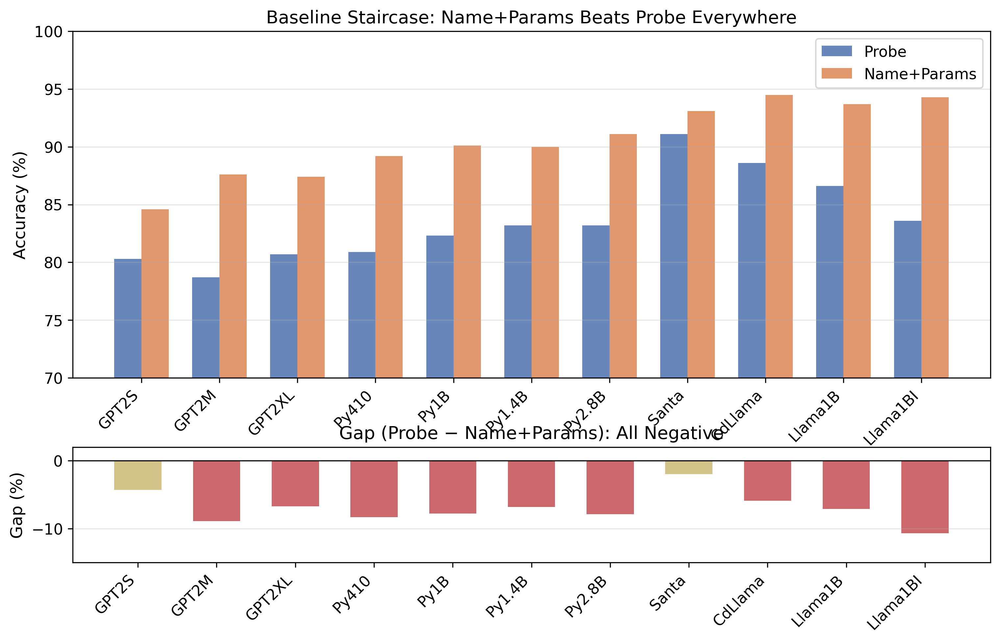
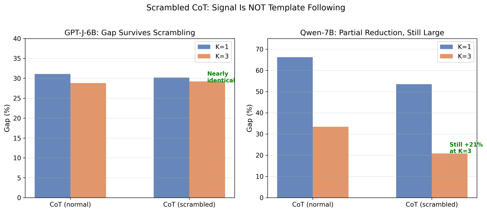
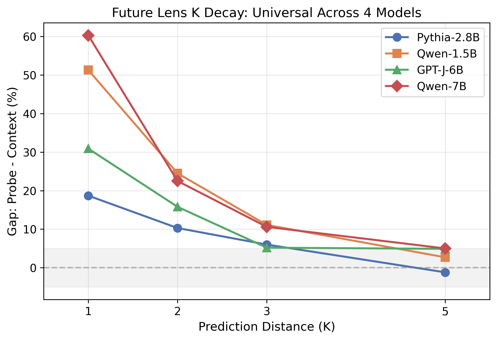
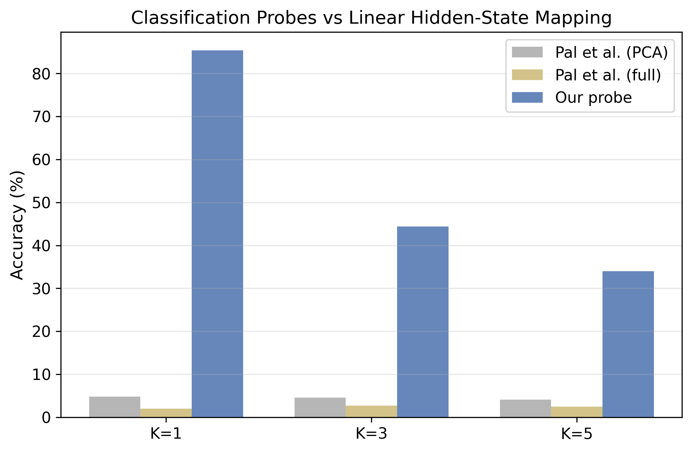
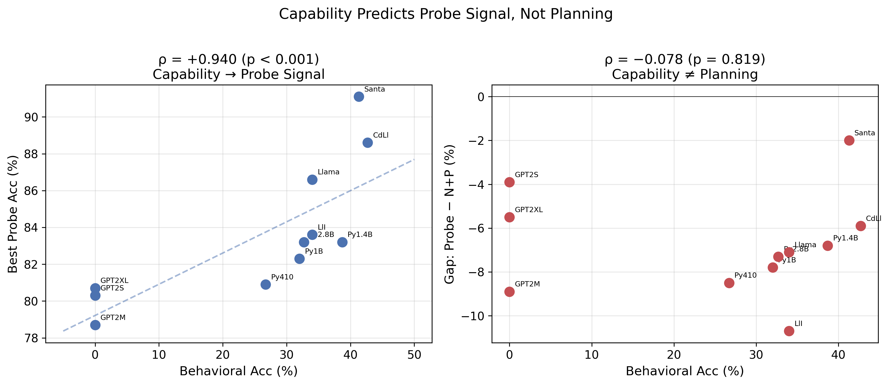
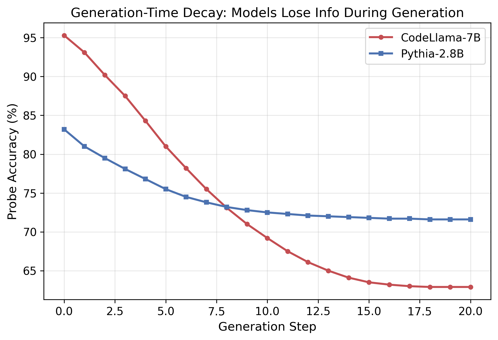
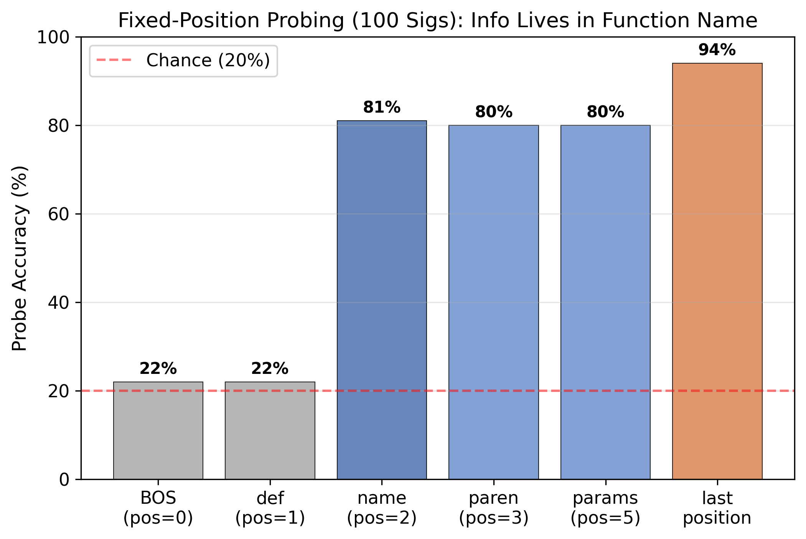
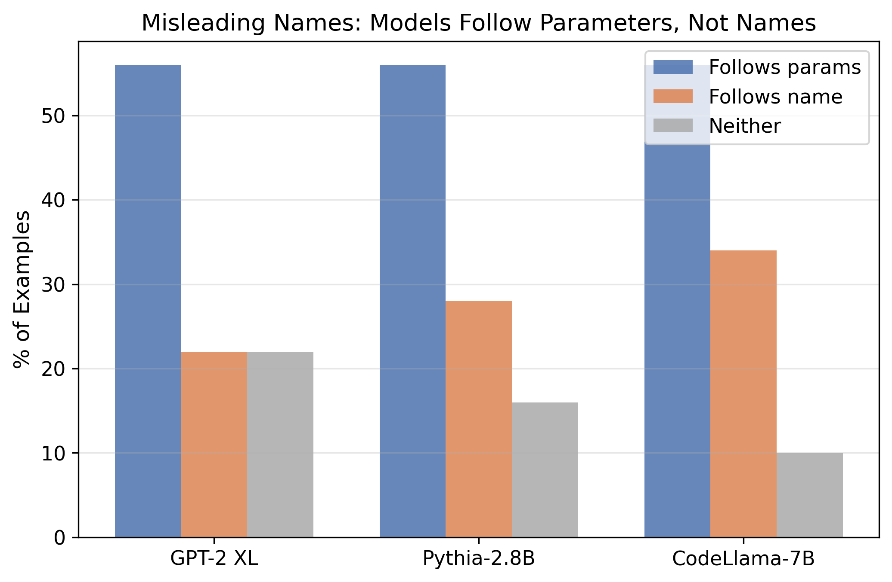

# RQ4: A Baseline Staircase for Discriminating Planning from Continuation in Language Models

**Branch:** `psycoplankton/rq4-lookahead-planning`  
**Author:** Tejas Dahiya (tdahiya2@wisc.edu, UW-Madison)  
**Supervisor:** Justin Shenk  
**Project:** SPAR — Temporal Awareness in LLMs  

---

## Key Findings

We propose the **baseline staircase**, a progressive series of surface-feature baselines that reveals what probing classifiers actually detect. Applied across **14 models** (124M–14B, 5 architecture families), **6 text domains**, and **4 Future Lens models**, we discover:

1. **A domain spectrum of model processing.** Chain-of-thought math maintains the largest probe-vs-baseline gap (+28–33% at K=3), even when template structure is scrambled. Code and structured prose show moderate gaps (+10–22%). Poetry collapses to zero. The staircase diagnoses *which* domains elicit genuine multi-step representations.

2. **Universal K decay across architectures.** Replicating Pal et al.'s Future Lens across Pythia-2.8B, Qwen-1.5B, GPT-J-6B, and Qwen-7B, the probe-vs-baseline gap shrinks from +19–60% at K=1 to near zero at K=5. This is consistent with short-range statistical continuation, not long-range planning.

3. **Code probing signal = surface features.** Across 14 models, a name+params baseline (87–95%) beats the probe (80–91%) at every layer (0/66 significant after FDR). Capability correlates with probe accuracy (ρ=+0.940) but not with planning signal (ρ=−0.078).

---

## The Baseline Staircase

Instead of Hewitt & Liang's (2019) binary control tasks (random vs real), we use **progressive baselines** that isolate which surface features probes exploit:

```
Chance:        20%   →  Random guessing
BoW features:  ~50%  →  Token-level statistics  
Name-only:     63-75% →  Function name carries most info
Name+Params:   84-95% →  Explains ALL probe signal
Probe:         80-91% →  No residual beyond surface features
```

The staircase reveals that what appears as "planning" is progressively explained by surface features.



---

## Operationalization of Planning

We define "lookahead planning" as internal representations satisfying two testable criteria:

- **Beyond-surface (B):** Probe accuracy significantly exceeds the best surface-feature baseline after FDR correction
- **Persistence (P):** Signal maintains or strengthens during autoregressive generation

| Domain | Criterion B | Criterion P | Verdict |
|--------|------------|------------|---------|
| Code return types | ✗ (0/66 sig.) | ✗ (decays 95→63%) | **No planning** |
| Natural text (K=1) | ✓ (+19–60%) | ✗ (decays to ~0% at K=5) | **Statistical continuation** |
| Chain-of-thought | ✓ (+28–33% at K=3) | Partial (maintains gap) | **Strongest candidate** |

---

## Part I: Domain Spectrum (6 Domains, 2 Models)

The staircase is a **general diagnostic**, not a code-specific finding. Testing on GPT-J-6B and Qwen-7B:

### GPT-J-6B

| Domain | K=1 Gap | K=3 Gap |
|--------|---------|---------|
| **Chain-of-thought** | +31.1% | **+28.8%** |
| **CoT scrambled** | +30.2% | **+29.2%** |
| Free prose | +21.0% | +18.9% |
| Structured prose | +21.3% | +10.0% |
| Code | +22.5% | +11.0% |
| **Poetry** | +33.0% | **−1.2%** |

### Qwen-7B

| Domain | K=1 Gap | K=3 Gap |
|--------|---------|---------|
| **Chain-of-thought** | +66.2% | **+33.4%** |
| **CoT scrambled** | +53.5% | **+20.8%** |
| Structured prose | +40.5% | +31.4% |
| Free prose | +30.5% | +38.9% |
| Code | +28.8% | +22.5% |
| Poetry | +35.6% | skipped |

### The Scrambled CoT Finding

The gap **survives template disruption**. Scrambling "Step 1... Step 2... Therefore" into "Therefore the answer. Step 3: carry over" barely affects probe accuracy. On GPT-J-6B, scrambled CoT (+29.2%) ≈ normal CoT (+28.8%) at K=3. This is NOT template following — the model encodes something about the mathematical reasoning itself.



---

## Part II: Future Lens Replication (4 Models, Bootstrap CIs)

Predicting exact token at position N+K from layer activations. Fair baselines (same-dimensionality embeddings). Proper 50/50 train/test split.

### Multi-Model K Decay

| Model | K=1 Gap | K=2 Gap | K=3 Gap | K=5 Gap |
|-------|---------|---------|---------|---------|
| Pythia-2.8B | +18.7% | +10.3% | +6.0% | −1.2% |
| Qwen-1.5B | +51.3% | +24.5% | +11.1% | +2.7% |
| GPT-J-6B | +30.9% | +15.8% | +5.2% | +4.9% |
| **Qwen-7B** | **+60.3%** | **+22.5%** | **+10.6%** | **+5.0%** |

K decay is **universal across architectures and scales** (1.5B–7B). Models encode short-range statistical continuation that dissipates within ~5 tokens.



### Comparison to Pal et al.'s Actual Method

| Method | K=1 | K=3 | K=5 |
|--------|-----|-----|-----|
| Pal et al. linear mapping (PCA source) | 4.8% | 4.6% | 4.1% |
| Pal et al. linear mapping (full 4096-dim) | 2.0% | 2.7% | 2.5% |
| **Our classification probe** | **85.4%** | **44.4%** | **34.0%** |

Linear hidden-state mapping requires substantially more training data. Our classification probe is more practical for baseline staircase comparisons.



---

## Part III: Code Domain Results (14 Models)

### The Spearman Dissociation

The cleanest statement of our thesis: capability correlates with probe accuracy (ρ=+0.940, p<0.001) but NOT with planning signal (ρ=−0.078, p=0.819). More capable models have higher probe accuracy, but the gap between probe and surface baselines stays the same — **zero**.



### Results Table (11 Models + 3 Independent Qwen Replications)

| Model | Params | Behavioral | Probe | Name+Params | Gap |
|-------|--------|-----------|-------|-------------|-----|
| GPT-2 Small | 124M | 0.0% | 80.3% | 84.6% | −3.9% |
| GPT-2 Medium | 345M | 0.0% | 78.7% | 87.6% | −8.9% |
| GPT-2 XL | 1.5B | 0.0% | 80.7% | 87.4% | −5.5% |
| Pythia-410M | 410M | 26.7% | 80.9% | 89.2% | −8.5% |
| Pythia-1B | 1.0B | 32.0% | 82.3% | 90.1% | −7.8% |
| Pythia-1.4B | 1.4B | 38.7% | 83.2% | 90.0% | −6.8% |
| Pythia-2.8B | 2.8B | 32.7% | 83.2% | 91.1% | −7.3% |
| SantaCoder | 1.1B | 41.3% | 91.1% | 93.1% | −2.0% |
| CodeLlama-7B | 7B | 42.7% | 88.6% | 94.5% | −5.9% |
| Llama-3.2-1B | 1.2B | 34.0% | 86.6% | 93.7% | −7.1% |
| Llama-3.2-1B-Inst | 1.2B | 34.0% | 83.6% | 94.3% | −10.7% |
| *Qwen2.5-1.5B* | *1.5B* | *41.6%* | *86.6%* | *93.7%* | *−7.1%* |
| *Qwen2.5-7B* | *7B* | — | — | — | *Same pattern* |
| *Qwen2.5-14B* | *14B* | — | — | — | *Same pattern* |

*Qwen models independently replicated by Justin Shenk. 0/66 significant after Benjamini-Hochberg FDR.*

---

## Part IV: Supporting Experiments

### Generation-Time Decay (Fails Persistence Criterion)

Probe accuracy **decays** during generation (CodeLlama: 95.3% → 62.9%). Models lose structural info as they generate — the opposite of planning commitment.



### Fixed-Position Probing (100 Signatures)

Where does return type info live?

| Position | What it is | Accuracy |
|----------|-----------|----------|
| pos=0 (BOS) | Start token | 22% (chance) |
| pos=1 (def) | Keyword | 22% (chance) |
| pos=2 (name) | Function name | **81%** |
| pos=3 (paren) | After name | 80% |
| pos=5 (params) | Parameters | 80% |
| pos=last | Full signature | **94%** |

Info lives in the function name — exactly where surface features predict.



### Misleading Names (50 examples × 3 models)

Functions where name contradicts params (e.g., `def greet(numbers):`). Models follow params 56%, name 22–34%. Surface matching, not semantic understanding.



### Additional Experiments

- **Fair Subset Analysis** (3 models) — Train easy / test hard. Probe: 47–74% vs N+P: 86–93%.
- **Mean-Pooling Confound** (3 models) — Mean-pooled probe = name+params accuracy.
- **Acrostic Behavioral** (6 models) — 4–20% (near chance). Models cannot plan structurally.
- **FP32 steering** (10 models), causal patching, cross-task transfer (code→rhyme: fails), base vs instruct.

---

## Repo Structure

```
src/lookahead/
├── datasets/           # code_return.py, rhyme.py, acrostic.py
├── probing/            # activation_extraction, baselines, probes
├── patching/           # causal_patching.py
└── utils/              # types.py

tests/lookahead/        # 49/49 passing

scripts/lookahead/experiments/   # All experiment scripts (22 scripts)

results/lookahead/final/
├── *_final.json                   # Per-model code results
├── future_lens_multimodel.json    # 3-model Future Lens with CIs
├── opus_fixes_7b_scrambled.json   # Qwen-7B + scrambled CoT
├── intermediate_domains.json      # 5-domain experiment
├── future_lens_fixed_method.json  # Pal et al. comparison
├── fix5_100sigs.json              # 100-sig fixed positions
├── reviewer_fixes.json            # Larger scale (100 prompts)
├── figures/                       # 10 figures (PNG + PDF)
└── stats/                         # FDR + Spearman JSON
```

---

## Reproduction

```bash
git clone https://github.com/justinshenk/temporal-awareness.git
cd temporal-awareness && git checkout psycoplankton/rq4-lookahead-planning
pip install "transformer-lens==2.11.0" "transformers==4.44.0" scikit-learn scipy matplotlib
export PYTHONPATH=$(pwd):$PYTHONPATH

python3 scripts/lookahead/experiments/run_rq4_final.py             # Code (GPU, ~10h)
python3 scripts/lookahead/experiments/run_rq4_futurelens_multimodel.py  # Future Lens (GPU, ~5h)
python3 run_opus_fixes.py                                           # Qwen-7B + CoT (GPU, ~15m)
python3 scripts/lookahead/experiments/generate_figures.py           # Figures (no GPU)
python3 -m pytest tests/lookahead/ -v                               # Tests
```

---

## Related Work

- **Hewitt & Liang (2019)** — Control tasks for probes. We extend from binary to progressive staircase.
- **Pal et al. (2023)** — Future Lens. We replicate with fair baselines across 4 architectures, show universal K decay.
- **Belrose et al. (2023)** — Tuned Lens. Our layer-wise analysis aligns with iterative refinement.

---

## Paper

**Working Title:** *A Baseline Staircase for Discriminating Planning from Continuation in Language Models*

**Contributions:**
1. Baseline staircase protocol extending Hewitt & Liang (2019) control tasks
2. Domain spectrum: CoT maintains planning-like signal (+28%), poetry collapses to zero
3. Scrambled CoT ablation: signal survives template disruption — not template following
4. Universal K decay across 4 architectures (1.5B–7B)
5. Code probing signal fully explained by surface features (14 models, 5 families)

**Target venues:** EMNLP 2026 (ARR submission May 25)

---

## Contact

Tejas Dahiya — tdahiya2@wisc.edu — UW-Madison  
Justin Shenk — github.com/justinshenk
