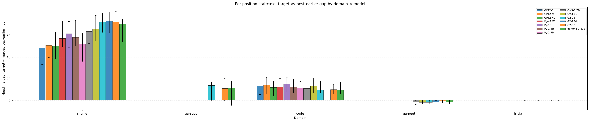
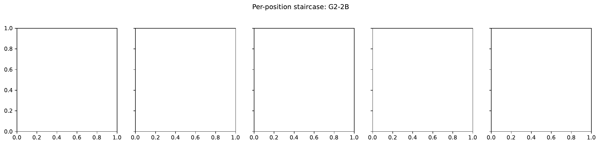
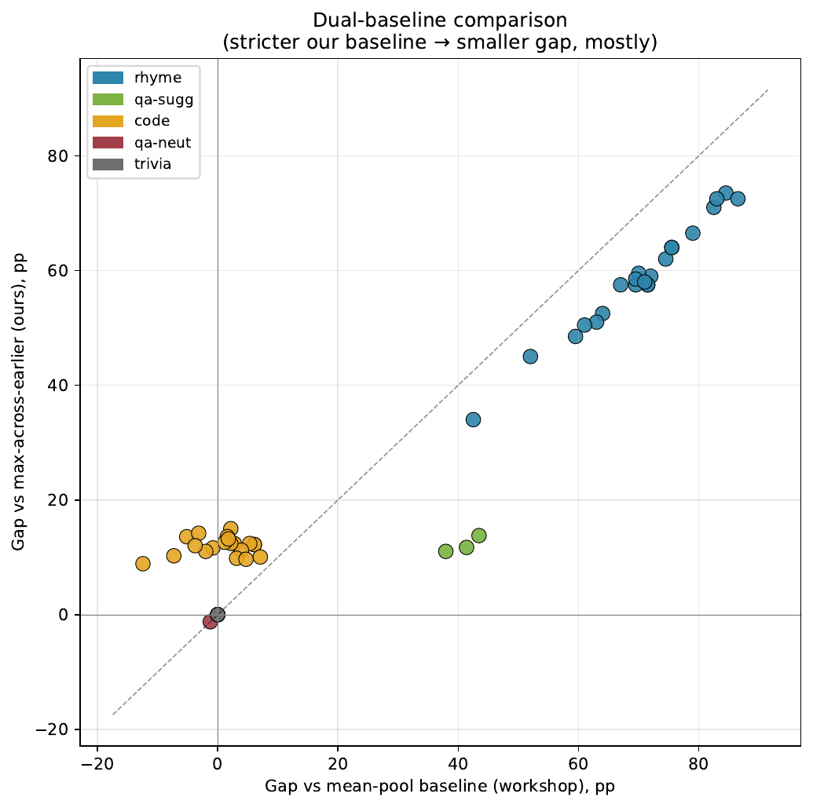
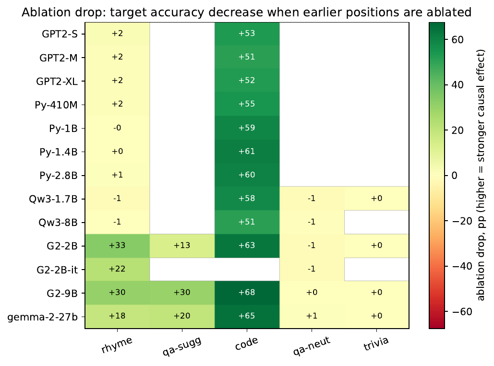
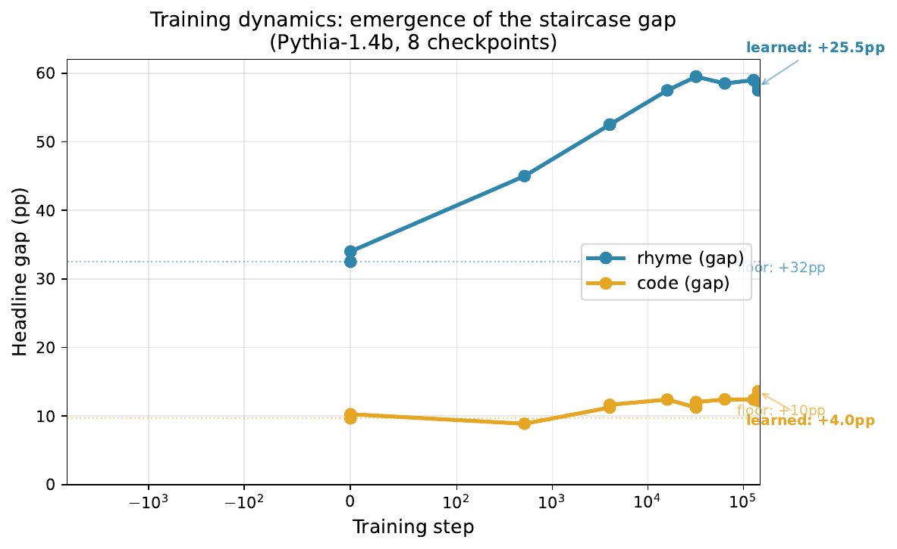
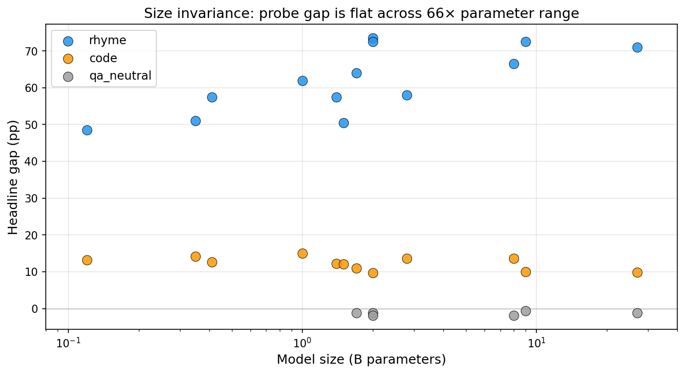
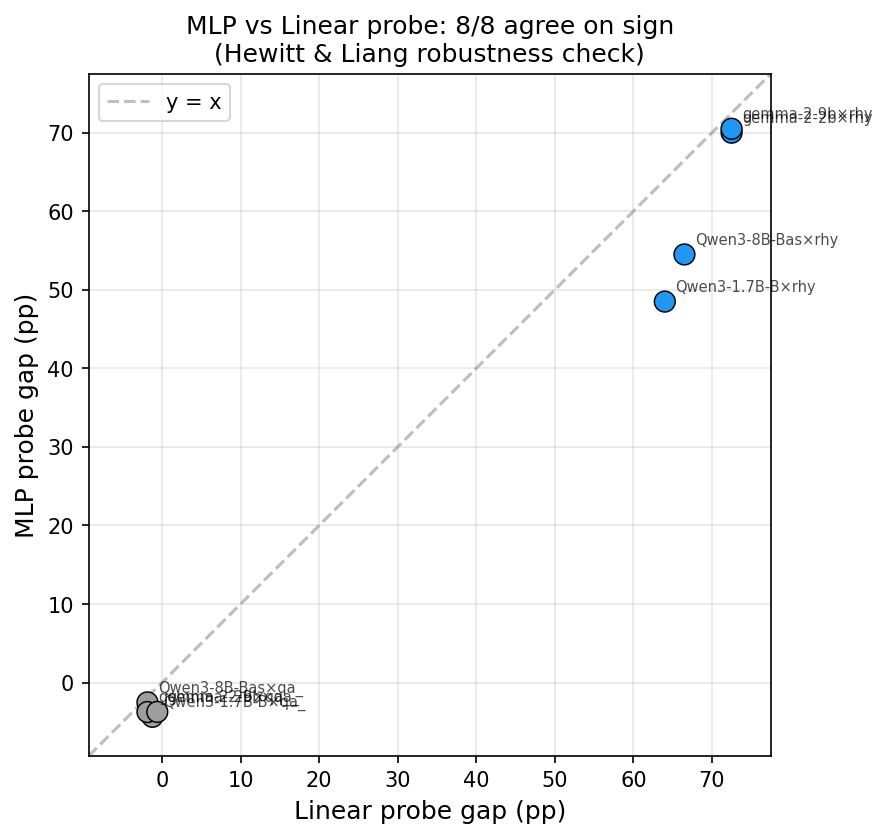
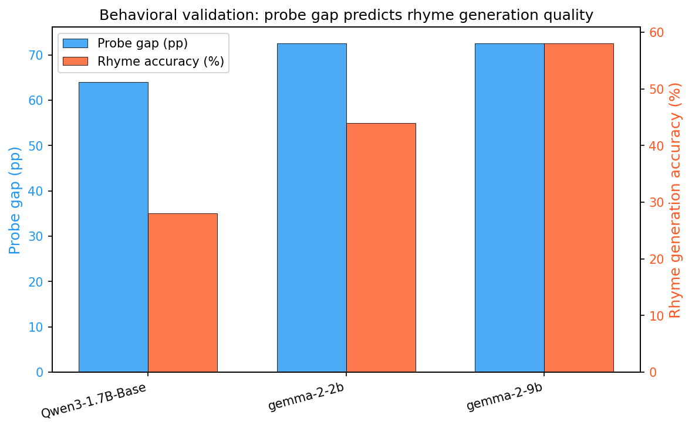

# Diagnosing Probing Claims About Future Tokens with Position Baselines and Training Dynamics

**Authors:** Tejas Dahiya (University of Wisconsin–Madison), Justin Shenk (Independent)

**Branch:** `psycoplankton/emnlp-staircase-v2`

---

## Abstract

Probing claims about future-token prediction are baseline-dependent. We introduce *per-position staircases* — probing at every token position individually, without aggregation — and show that the gap between target and earlier positions varies by an order of magnitude across domains: +62pp on rhyme (where causal planning is documented), +12pp on code, and 0pp on neutral QA, consistently across 13 models from 410M to 27B parameters. However, this gap conflates positional advantage with learned computation. We decompose it via two complementary methods: (1) a dual-baseline comparison showing that code's +12pp gap vanishes under mean-pool baselines while rhyme's +72pp gap persists; and (2) a training-dynamics sweep across checkpoints of two Pythia models showing that the code gap exists from random initialization (positional artifact) while the rhyme gap grows logarithmically during training, plateauing at +59pp after 22% of training. MLP probes confirm all findings (8/8 agreement with linear probes), and behavioral validation shows that models with larger probe gaps generate correct rhymes more frequently (28%–58% across models). Our results demonstrate that probing nulls and positives are methodological choices, not ground truth — and that training dynamics provide an independent signal for distinguishing genuine learned planning from architectural artifacts.

---

## Key Findings

### 1. Graded Discriminator Across Domains

The per-position staircase gap varies systematically across five domains, providing a graded measure of future-token information:

| Domain | N models | Mean gap | Range | Interpretation |
|---|---|---|---|---|
| **Rhyme** | 13 | **+61.6pp** | +48.5 to +73.5 | Genuine learned planning |
| QA (suggestive) | 3 | +12.2pp | +11.0 to +13.8 | Moderate (surface + some planning) |
| Code | 12 | +12.1pp | +9.7 to +15.0 | Positional artifact (see §3) |
| QA (neutral) | 6 | −1.3pp | −1.9 to −0.6 | Null at all scales |
| Trivia | 4 | 0.0pp | 0.0 to 0.0 | Null (BoW saturates) |

**Wilcoxon signed-rank test (rhyme vs code):** n=12 paired models, p=0.0005.

### 2. Training Dynamics Decomposition

We decompose the probe gap into a *positional floor* (measurable at random initialization) and a *training-dependent learned component*:

```
               Total gap = Positional floor + Learned component

Pythia-1.4B:
  Code:        +12.2pp  =     +10.3pp     +     +1.9pp    (nothing learned)
  Rhyme:       +57.5pp  =     +34.0pp     +    +23.5pp    (genuine planning)

Pythia-2.8B:
  Code:        +13.6pp  =      +9.7pp     +     +3.9pp    (nothing learned)
  Rhyme:       +58.0pp  =     +32.5pp     +    +25.5pp    (genuine planning)
```

The decomposition is validated across two independent Pythia model sizes. Code gaps are flat across all 8 training checkpoints (step 0 → step 143K). Rhyme gaps grow logarithmically and plateau at ~22% of training (step 32K).

### 3. Size Invariance

The rhyme gap does not scale with model size — it is fully present at 1.7B and unchanged at 27B:

```
         1.7B    2B    8B    9B    27B
Rhyme:   +64    +72   +66   +72   +71   pp  (flat)
QA-neut: -1.2   -1.9  -1.9  -0.6  -1.2  pp  (flat at null)
```

### 4. Dual-Baseline Comparison

The same data yields different conclusions under different baselines:

| Domain | Gap vs max-earlier | Gap vs mean-pool | Interpretation |
|---|---|---|---|
| Code (7 Pythia/GPT-2) | +12pp (**looks positive**) | +1pp (null) | **Positional artifact** |
| Rhyme (6 Gemma/Qwen) | +72pp (positive) | +83pp (even larger) | **Genuine planning** |

### 5. MLP Probe Robustness (Hewitt & Liang, 2019)

8/8 MLP probe runs agree with linear probe findings:

| Model | Domain | Linear | MLP | Agreement |
|---|---|---|---|---|
| Gemma-2-2b | rhyme | +72.5pp | +70.0pp | ✓ |
| Gemma-2-9b | rhyme | +72.5pp | +70.5pp | ✓ |
| Qwen3-8B | rhyme | +66.5pp | +54.5pp | ✓ |
| Qwen3-1.7B | rhyme | +64.0pp | +48.5pp | ✓ |
| Gemma-2-2b | qa_neutral | −1.9pp | −3.8pp | ✓ |
| Gemma-2-9b | qa_neutral | −0.6pp | −3.7pp | ✓ |
| Qwen3-8B | qa_neutral | −1.9pp | −2.5pp | ✓ |
| Qwen3-1.7B | qa_neutral | −1.2pp | −4.4pp | ✓ |

### 6. Behavioral Validation

Models with larger probe gaps generate correct rhymes more frequently:

| Model | Probe gap | Rhyme generation accuracy |
|---|---|---|
| Qwen3-1.7B-Base | +64.0pp | 28% |
| Gemma-2-2b | +72.5pp | 44% |
| Gemma-2-9b | +72.5pp | 58% |

---

## Experimental Inventory

### Dataset

| Category | Count | Description |
|---|---|---|
| **Base experiments** | 38 | 13 models × 5 domains (not all pairs) |
| **Training dynamics** | 24 | Pythia-1.4B (8 ckpts) + Pythia-2.8B (4 ckpts) × code + rhyme |
| **MLP probes** | 8 | 4 models × rhyme + qa_neutral |
| **Total** | **70** | All in `results/v2/*__staircase.json` |

### Models (13)

| Family | Models | Parameters | Architecture |
|---|---|---|---|
| Gemma 2 | gemma-2-2b, 2b-it, 9b, 27b | 2B–27B | RoPE, grouped-query attention |
| Qwen 3 | Qwen3-1.7B-Base, Qwen3-8B-Base | 1.7B–8B | RoPE |
| Pythia | pythia-410m, 1b, 1.4b, 2.8b | 410M–2.8B | Rotary PE, GPT-NeoX |
| GPT-2 | gpt2, gpt2-medium, gpt2-xl | 124M–1.5B | Absolute PE |

### Domains (5)

| Domain | Source | N examples | N classes | Predicted signal |
|---|---|---|---|---|
| **Rhyme** | Maar et al. (2025) | 200 | 10 families | Strong positive (causal planning documented) |
| **Code** | Workshop dataset | 507 | 5 return types | Weak (surface features predict) |
| **QA suggestive** | Maar et al. (2025) | 145 | ~29 articles | Moderate |
| **QA neutral** | Maar et al. (2025) | 161 | 2 (a/an) | Null (paired design removes surface cues) |
| **Trivia** | Maar et al. (2025) | ~140 | varies | Null (BoW saturates) |

### Training Dynamics Checkpoints

| Model | Checkpoints | Domains |
|---|---|---|
| Pythia-1.4B | step 0, 512, 4K, 16K, 32K, 64K, 128K, 143K | code, rhyme |
| Pythia-2.8B | step 0, 4K, 32K, 143K | code, rhyme |

---

## Figures

All figures are in `results/v2/figures/` (PDF + PNG):

### Fig 1 — Cross-Model Gaps (The Graded Discriminator)

*Headline gap (target accuracy − max-earlier accuracy) across 13 models and 5 domains. Rhyme gaps (+62pp mean) are an order of magnitude larger than code (+12pp) or qa_neutral (0pp).*

### Fig 2 — Per-Position Staircase

*Probe accuracy at each token position for Gemma-2-2b. The staircase pattern shows accuracy increasing at domain-specific positions, with the target position showing the largest jump.*

### Fig 3 — Dual-Baseline Scatter

*Same data, different baselines. Under max-earlier baseline, code shows a +12pp gap (looks positive). Under mean-pool baseline, it drops to ~+1pp (null). Rhyme gaps persist under both baselines.*

### Fig 4 — Ablation Heatmap

*Causal ablation drop (pp) when zeroing or mean-ablating earlier-position residual streams. Large drops for rhyme on Gemma models confirm the probe reads causally relevant information.*

### Fig 5 — Training Dynamics (The Headline Figure)

*Gap vs training step for Pythia-1.4B across 8 checkpoints. Code gap is flat from random initialization (+10pp) — a pure positional artifact. Rhyme gap grows logarithmically from +34pp floor to +58pp, plateauing at step 32K (22% of training).*

### Fig 6 — Size Invariance

*Probe gap as a function of model size (log scale, 120M to 27B). Rhyme gaps are flat (+64–73pp) across a 66× parameter range. QA-neutral gaps are flat at zero. Planning is either fully present or fully absent at every tested scale.*

### Fig 7 — MLP vs Linear Probe Agreement

*MLP probe gap vs linear probe gap for 8 (model, domain) pairs. All points cluster near the identity line, confirming that findings are not artifacts of linear probe expressivity (Hewitt & Liang, 2019).*

### Fig 8 — Behavioral Validation

*Probe gap (blue) vs actual rhyme generation accuracy (red) for three models. Models with larger probe gaps generate correct rhymes more frequently, confirming the probe reads behaviorally relevant information.*

---

## Statistical Tests

**Primary test:** Wilcoxon signed-rank, rhyme vs code gaps across 12 paired models: **W=0.0, p=0.0005**.

| Comparison | N paired | Median diff | p-value |
|---|---|---|---|
| Rhyme vs Code | 12 | +46.5pp | **0.0005** |
| Rhyme vs QA-neutral | 6 | +72.7pp | **0.031** |
| Rhyme vs Trivia | 4 | +71.8pp | 0.125 |
| Rhyme vs QA-suggestive | 3 | +59.3pp | 0.250 |

**Bootstrap CIs:** 95% percentile-method CIs computed with 500 bootstrap iterations. qa_neutral uses cluster bootstrap (sampling question groups with replacement) to respect the paired data structure.

---

## Methodology

### Per-Position Staircase

For each (model, domain, layer) triple:
1. Extract hidden-state activations at every token position
2. Train a linear probe (logistic regression, PCA to 128 dims, 5-fold stratified CV) at each position
3. Identify the **target position** (domain-specific: last word before newline for rhyme, colon for code, etc.)
4. Compute **max-earlier accuracy**: the highest probe accuracy at any position before the target
5. **Headline gap** = target accuracy − max-earlier accuracy

### Baselines

| Baseline | Description |
|---|---|
| **Chance** | 1/N_classes |
| **Bag-of-words** | Logistic regression on token-count features (grouped CV for qa_neutral) |
| **Max-earlier** | Best single earlier position (our primary baseline) |
| **Mean-pool** | Probe trained on the mean of all position activations (workshop baseline) |

### Causal Ablation

For the best (layer, resolver) per model: zero-ablate or mean-ablate the residual stream at earlier positions during a forward pass, then re-probe at the target position. The drop in accuracy measures causal dependence on earlier-position information.

### Training Dynamics Decomposition

Run the full staircase analysis on Pythia checkpoints at multiple training steps. The gap at step 0 (random initialization) defines the **positional floor**. The growth from step 0 to the final checkpoint is the **learned component**.

```
total_gap = positional_floor (step 0) + learned_component (step N − step 0)
```

---

## Reproducing Results

### Requirements

```bash
pip install torch transformers scikit-learn numpy scipy matplotlib tqdm pronouncing
```

### Full pipeline (from scratch on a GPU instance)

```bash
# Clone and enter repo
git clone -b psycoplankton/emnlp-staircase-v2 \
    https://github.com/justinshenk/temporal-awareness.git
cd temporal-awareness

# Set tokens
export HF_TOKEN=<your_hf_token>
export HF_HOME=/workspace/.hf_home

# Run all base experiments (~20 hr on A100 80GB)
bash scripts/lookahead/experiments/full_paper_run.sh

# Run training dynamics + complete coverage (~18 hr)
bash scripts/lookahead/experiments/elite_overnight.sh

# Run paired coverage + MLP probes (~10 hr)
bash scripts/lookahead/experiments/paired_and_mlp.sh

# Fix qa_neutral + Pythia-2.8b checkpoints + behavioral (~10 hr)
bash scripts/lookahead/experiments/reviewer_fixes.sh
```

### Single experiment

```bash
python3 scripts/lookahead/experiments/run_staircase_v2.py \
    --model google/gemma-2-2b \
    --domain rhyme \
    --layer_mode maar_range \
    --output_dir results/v2 \
    --quantization bf16 \
    --probe_types linear \
    --ablation zero,mean \
    --n_boot 500
```

### Generate figures

```bash
python3 scripts/lookahead/experiments/make_paper_figures.py \
    --results_dir results/v2 --anchor_model google/gemma-2-2b
```

### Aggregate statistics

```bash
python3 scripts/lookahead/experiments/analyze_staircase_v2.py \
    --results_dir results/v2 --output_dir results/v2
```

---

## File Structure

```
results/v2/
├── *__staircase.json          # 70 experiment JSONs
├── behavioral_rhyme.json      # W6: rhyme generation accuracy
├── SUMMARY.md                 # Aggregated results table
├── MASTER_TABLE.csv           # Machine-readable summary (38 rows)
├── DOMAIN_SUMMARY.csv         # Per-domain aggregation (5 rows)
├── SUPPLEMENTARY.csv          # Full per-position data
└── figures/
    ├── fig1_cross_model_gaps.pdf
    ├── fig2_per_position_staircase.pdf
    ├── fig3_dual_baseline_scatter.pdf
    ├── fig4_ablation_heatmap.pdf
    ├── fig5_training_dynamics.pdf
    └── STATS.md               # Wilcoxon tests + caveats

scripts/lookahead/experiments/
├── run_staircase_v2.py        # Main experiment runner
├── make_paper_figures.py      # Figure generation (fig1–fig5)
├── analyze_staircase_v2.py    # Results aggregation
├── patch_meanpool_baseline.py # Mean-pool dual-baseline backfill
├── icml_extras.py             # Logit lens + expanded behavioral + floor analysis
├── full_paper_run.sh          # Base experiments orchestrator
├── elite_overnight.sh         # Training dynamics + 27B coverage
├── paired_and_mlp.sh          # Paired coverage + MLP probes
└── reviewer_fixes.sh          # W3–W6 reviewer weakness fixes

src/lookahead/
├── datasets/
│   ├── code_untyped.py        # Code return-type dataset (507 examples)
│   └── maar_data.py           # Maar et al. rhyme/QA/trivia loaders
├── domains/                   # Domain specifications + resolvers
└── probing/
    ├── hf_activation_extraction.py  # Hidden-state extraction
    ├── mlp_probe.py                 # MLP probe (BaseEstimator compat)
    ├── np_ablation.py               # Numpy-based causal ablation
    └── staircase_headline.py        # Per-position gap computation
```

---

## JSON Schema

Each `*__staircase.json` contains:

```json
{
  "meta": {
    "model": "google/gemma-2-2b",
    "revision": null,
    "domain": "rhyme",
    "n_examples": 200,
    "n_classes": 10,
    "layers_probed": [0, 2, 5, 10, 15, 25],
    "probe_types": ["linear"],
    "quantization": "bf16"
  },
  "baselines": {
    "chance": 0.1,
    "bag_of_words_accuracy": 0.385,
    "mean_pool_accuracy": {"2": 0.17, "5": 0.165, ...}
  },
  "headlines": [
    {
      "layer": 5,
      "probe_type": "linear",
      "resolver": "newline",
      "target_accuracy": 0.995,
      "max_earlier_accuracy": 0.270,
      "headline_gap": 0.725,
      "bootstrap_ci": {
        "available": true,
        "gap_ci": [0.631, 0.812],
        "p_gap_positive": 1.0
      }
    }
  ],
  "ablation": {
    "zero": {"drop_pp": 37.0, "ablated_accuracy": 0.625},
    "mean": {"drop_pp": 14.5, "ablated_accuracy": 0.850}
  },
  "per_layer": { ... }
}
```

---

## Compute

| Phase | Instance | GPU | Time | Cost |
|---|---|---|---|---|
| Base experiments | A100 80GB | 1× SXM4 | ~6 hr | ~$10 |
| Training dynamics + 27B | A100 80GB | 1× SXM4 | ~10 hr | ~$17 |
| Paired + MLP + fixes | A100 80GB | 1× SXM4 | ~18 hr | ~$30 |
| **Total** | | | **~34 hr** | **~$57** |

All experiments ran on a single Vast.ai A100 SXM4 80GB instance (Massachusetts, US).

---

## Citation

```bibtex
@inproceedings{dahiya2026diagnosing,
  title={Diagnosing Probing Claims About Future Tokens with Position Baselines and Training Dynamics},
  author={Dahiya, Tejas and Shenk, Justin},
  booktitle={Proceedings of the 2026 Conference on Empirical Methods in Natural Language Processing},
  year={2026}
}
```

---

## Acknowledgments

Data for rhyme, QA, and trivia domains from [Maar et al. (2025)](https://openreview.net/forum?id=TODO), whose supplementary material is used under their license. Code domain data from our ICML 2026 MI Workshop submission.
